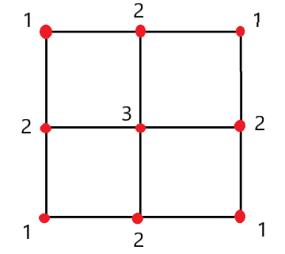

---

layout: page
mathjax: true
title: An exercise in probability

tagline:
description: simple and beautiful exercise

---

The following problem is given
>A particle is placed uniformly at one of the nine points in a $3\times3$ square grid. The particle then
>performs a random walk such that at each step one of the adjacent points (to the right or left, upwards
>or downwards) is chosen with equal probabilities. This means that the particle never remains in a point
>or moves diagonally.\\
>The question is to find the probability that the particle after three steps is at the central point.

{:height="300px" width="270px"}{: .center-image }\\
Now, the standard way to approach the problem would be to consider all possible combinations to reach
the center point, compute their probabilities and summing them, since each one corresponds to a different
outcome of a random experiment.\\
This leads naturally to a series of matrix multiplications; using the notation that is typical
of the discrete states Markov chains, of which this is a basic example, I will call $P$ the transition matrix,
that is the matrix whose element $p_{ij}$ represents the probability for the particle of moving from
state $i$ to state $j$; here I will enumerate the states
by row, as shown in the picture above; as an example, $p_{12}$ is $\frac{1}{2}$ since from state $1$ the particle
can only move to state $4$ or state $2$.\\
To find the probability of being in state $5$ after three steps I compute $P^3$, corresponding to the transition 
matrix after three steps, and multiply a row vector of elements all equal to $\frac{1}{9}$ for
the column number five of the
matrix. Performing this algebraic computation in any software it gives as result $\frac{4}{27}$.\\
Let's now move to the interesting part, and pose ourself this question:
are we able, through abstract thinking, to transform the problem
in a simpler one? If you think about it, the answer is yes.\\
In the previous computation, we considered all the points as disctinct states of a Markov chain.
But the symmetry of the problem might suggest us that the point that lies in the top-left corner is not
different from the point that lies in the bottom-right corner. An analogous consideration can be done
for the top-middle and middle-left points and so on.\\
So the idea is to pass from a Markov chain with nine states to a Markov chain with just three states;
I will refer to this states as *abstract states*, and will enumerate them like in the following picture\\
\\
{:height="300px" width="270px"}{: .center-image }\\
You might wonder if the two representations are equivalent or not, so let's give it some more thoughts.
When the particle lies in the vertices (abstract state $1$), it can
only move to a point belonging to abstract state $2$ . Similarly, when it
is in abstract state $2$, it will have $\frac{1}{3}$ chances to move to abstract state $3$
and $\frac{2}{3}$chances to move to abstract state $1$.\\
Finally, when particle lies in the center, it will necessarily move to abstract state $2$.
It is clear that, if we are interested only in the probability of ending up in abstract state $3$, the exact
state of the possible nine does not matter , but it is only the three of our abstract states that matter!\\
What we could do at this point is build up another (much smaller!) transition matrix for
our simplified Markov chain, but our previous considerations might suggest us another smarter way
to proceed.\\
In fact, you may have noticed that if the particle starts in abstract
state $2$, no matter what (abstract) state the particle visits in the next step, after two steps it will be
again in abstract state $2$. If the particle start from abstract states $1$ and $3$, after one step it will lie in
abstract state $2$ and so happens after an odd number of steps. The only possibility for the particle to be
in abstract state $3$ after
three steps is to start from abstract state $2$ (and this happens with probability $\frac{4}{9}$); conditioning on that, the probability
that at the third step the particle will move from state $2$ to state $3$ is $\frac{1}{3}$, so that overall I have a probability\\
$$\frac{1}{3}\cdot\frac{4}{9}=\frac{4}{27}$$\\
Therefore, we reached the same conclusion as before in a much more "elegant" way.

